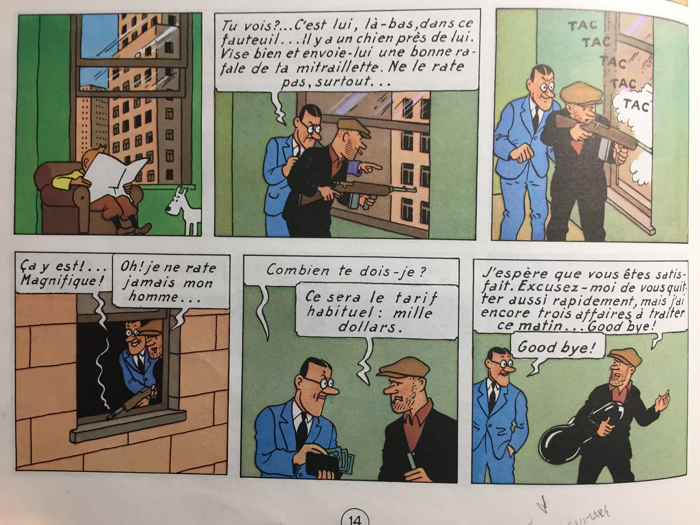
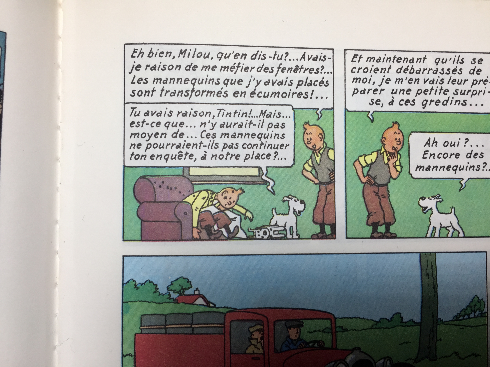

<!-- .slide: data-background-image="img/musket.jpg" -->
<!-- .slide: class="hover"-->

### Le roman-feuilleton.   Des outils littéraires pour l'analyse des séries-télé

Enrico Agostini-Marchese   CRC sur les écritures numériques   Université de Montréal
 
 
CIN 2122 - Hiver 2018
 Montréal - 21 mars 2018

 <!-- .element: class="logo" style="width:20%; background-color:ghostwhite;padding: 5px" -->

<!-- .element: style="font-size:1.4rem" -->

 <!-- .element: class="logo" -->

%%%%%%%%%%%%%%%%%%%%%%%%%%%%%%%%%%%%%%%%%%%%%
<!-- .slide: data-background-image="img/paralitt.jpg" data-background-size="contain"-->
<!-- .slide: class="hover"-->
# Qu'est-ce que la _para_-littérature ?

Du grec « παρά » : à côté de, en marge, presque
 
 
Exemples ; para-médical, para-normal, para-texte
§§§§§§§§§§§§§§§§§§§§§§§§§§§§§§§§§§§§§§§§§§§§§
<!-- .slide: data-background-image="img/vraie.jpg" data-background-size="contain"-->
<!-- .slide: class="hover"-->
### Quelques questions problématiques

  <ul>
  <li>La <b>L</b>ittérature ou la <b>l</b>ittérature ? - Valeur culturelle au sens large</li>
  <li>Approches différentes selon l'époque, les modes et les pensées</li>
  <li>Institutionnalisation de la littérature : qui décide de la valeur esthétique d'une œuvre ?</li>
  <li>Définition qui dérive de celle de littérature</li>
  <li>Littérature sans valeur esthétique ? Littérature de masse, commerciale, populaire, de genre, récréative, ...</li>
  </ul>
§§§§§§§§§§§§§§§§§§§§§§§§§§§§§§§§§§§§§§§§§§§§§
<!-- .slide: data-background-image="img/bookstore.jpg" data-background-size="auto"-->
<!-- .slide: class="hover"-->
### Expressions pour caractériser la paralittérature :
  - Mode de production (grande diffusion, grand tirage, de masse)
  - Mode de publication (feuilleton)
  - Circuit de distribution (gare, supermarché)
  - Nature du papier employé
  - Prix des livres ou des fascicules
  - Nature du consommateur
  - Nature de la consommation
%%%%%%%%%%%%%%%%%%%%%%%%%%%%%%%%%%%%%%%%%%%%%
<!-- .slide: data-background-image="img/fantastique.png" data-background-size="contain"-->
<!-- .slide: class="hover"-->
# Genre
Catégorie d'œuvres définie par un ensemble de règles et de caractères communs

§§§§§§§§§§§§§§§§§§§§§§§§§§§§§§§§§§§§§§§§§§§§§
<!-- .slide: data-background-image="img/sonnet.jpg" data-background-size="contain"-->
<!-- .slide: class="hover"-->
# Convention de genre

- Conventions régulatrices (exemple : sonnet)
- Conventions de tradition (exemple : le roman)
- Forme (types de poésie - prose...)
- Contenu
§§§§§§§§§§§§§§§§§§§§§§§§§§§§§§§§§§§§§§§§§§§§§
<!-- .slide: data-background-image="img/tragedie.JPG" data-background-size="contain"-->
<!-- .slide: class="hover"-->
# Aristote
- Moyens
- Objets
- Modes
§§§§§§§§§§§§§§§§§§§§§§§§§§§§§§§§§§§§§§§§§§§§§
<!-- .slide: data-background-image="img/netflix.png" data-background-size="contain"-->
<!-- .slide: class="hover"-->
# Le genre dans la série-télé

- Genre proprement televisuel : format, type de sérialité, modes de production, l'heure de diffusion, public visé (téléroman, sitcom, minisérie, soap opera)
- Genre dérivé de la tradition littéraire : comédie, mélodrame, tragédie, drame, comédie dramatique
- Sous-genre : policier, fantastique, science-fiction

Danielle Aubry, _Du roman-feuilleton à la série télévisuelle_

<!-- .element: class="source" -->

%%%%%%%%%%%%%%%%%%%%%%%%%%%%%%%%%%%%%%%%%%%%%
<!-- .slide: data-background-image="img/feuilleton.jpg" data-background-size="contain"-->
<!-- .slide: class="hover"-->
# Naissance du roman-feuilleton

- Qu'est-ce qu'un feuilleton ?
- XIXe siècle, critiques théâtrales et littéraires
- 1836, Fabien Girardin et _La presse_
- Mode de publication qui dévient assez rapidement un genre à part entière
- Différences avec la littérature de colportage

§§§§§§§§§§§§§§§§§§§§§§§§§§§§§§§§§§§§§§§§§§§§§

<!-- .slide: data-background-image="img/zola.jpg" data-background-size="contain" -->
<!-- .slide: class="hover"-->

# Une littérature industrielle

- Engouement du public
- Fidélisation du lecteur
- Une révolution : la démocratisation de la presse.

§§§§§§§§§§§§§§§§§§§§§§§§§§§§§§§§§§§§§§§§§§§§§
<!-- .slide: data-background-image="img/romanfeuilleton.JPEG" data-background-size="contain" -->
<!-- .slide: class="hover"-->
# Le roman-feuilleton dans les journaux

- Première étape : pré-publication des romans
- Deuxième étape : première publication
§§§§§§§§§§§§§§§§§§§§§§§§§§§§§§§§§§§§§§§§§§§§§
<!-- .slide: data-background-image="img/eugene.jpeg" data-background-size="contain" -->
<!-- .slide: class="hover"-->
# Les acteurs du feuilleton

- Auteur.e.s
- "Nègres"
- Directeurs des journaux
- Public
§§§§§§§§§§§§§§§§§§§§§§§§§§§§§§§§§§§§§§§§§§§§§
<!-- .slide: data-background-image="img/journal.jpg" data-background-size="contain" -->
<!-- .slide: class="hover"-->
## Des techniques littéraires et poétiques

- Répétitions
  - Explications
  - Récapitulations
  - Anticipations
- Suspense de bas de page/Cliffhanger
- Rocambolesque
- Sensationnalisme
- Rédondances
- Nouveau rapport entre fiction et consommation
- Sérialité vs épisodes fermés

§§§§§§§§§§§§§§§§§§§§§§§§§§§§§§§§§§§§§§§§§§§§§
## Répétitions : explications
<iframe width="800" height="600" src="https://quartermaester.info/" frameborder="0" allow="autoplay; encrypted-media" allowfullscreen></iframe>
§§§§§§§§§§§§§§§§§§§§§§§§§§§§§§§§§§§§§§§§§§§§§
# Répétitions : récapitulation
<iframe width="560" height="315" src="https://www.youtube.com/embed/B76nywIRPIY?start=470" frameborder="0" allow="autoplay; encrypted-media" allowfullscreen></iframe>
§§§§§§§§§§§§§§§§§§§§§§§§§§§§§§§§§§§§§§§§§§§§§
### Suspende de bas de page / Cliffhanger

§§§§§§§§§§§§§§§§§§§§§§§§§§§§§§§§§§§§§§§§§§§§§

§§§§§§§§§§§§§§§§§§§§§§§§§§§§§§§§§§§§§§§§§§§§§
<iframe width="560" height="315" src="https://www.youtube.com/embed/n6DmWeJtKKs?start=140" frameborder="0" allow="autoplay; encrypted-media" allowfullscreen></iframe>
§§§§§§§§§§§§§§§§§§§§§§§§§§§§§§§§§§§§§§§§§§§§§
<iframe width="560" height="315" src="https://www.youtube.com/embed/w6j-60Td0a4?start=470" frameborder="0" allow="autoplay; encrypted-media" allowfullscreen></iframe>
%%%%%%%%%%%%%%%%%%%%%%%%%%%%%%%%%%%%%%%%%%%%%
<!-- .slide: data-background-image="img/paratexte.jpg" data-background-size="contain" -->
<!-- .slide: class="hover"-->
# Le paratexte

> Les éléments paratextuels dont « on sait pas si l’on doit ou non considérer qu’[ils] appartiennent [au texte], mais qui en tout cas l’entourent et les prolongent, précisément pour le présenter, au sens habituel de ce verbe, mais aussi en son sens le plus fort : pour le rendre présent, pour assurer sa présence au monde, sa “réception” et sa consommation, sous la forme, aujourd’hui du moins, d’un livre »

> « Cette frange […] constitue, entre texte et hors-texte, une zone non seulement de transition, mais de transaction : lieu privilégié d’une pragmatique et d’une stratégie, d’une action sur le public au service, bien ou mal compris et accompli, d’un meilleur accueil du texte et d’une lecture plus pertinente »

<!-- .element: style="font-size:1.4rem; text-align:justify" -->

Gérard Genette, _Seuils_

<!-- .element: class="source" -->
§§§§§§§§§§§§§§§§§§§§§§§§§§§§§§§§§§§§§§§§§§§§§
<!-- .slide: data-background-image="img/paratexte.jpg" data-background-size="contain" -->
§§§§§§§§§§§§§§§§§§§§§§§§§§§§§§§§§§§§§§§§§§§§§
<!-- .slide: data-background-image="img/dedicace.jpg" data-background-size="contain" -->
<!-- .slide: class="hover"-->
# Péritexte

> « Un élément de paratexte, si du moins il consiste en un message matérialisé, a nécessairement un emplacement, que l’on peut situer par rapport à celui du texte lui-même : autour du texte, dans l’espace du même volume, comme le titre ou la préface, et parfois inséré dans les interstices du texte, comme les titres des chapitres ou certaines notes ; j’appellerai __péritexte__ cette première catégorie spatiale »

<!-- .element: style="font-size:1.4rem; text-align:justify" -->

Gérard Genette, _Seuils_

<!-- .element: class="source" -->
§§§§§§§§§§§§§§§§§§§§§§§§§§§§§§§§§§§§§§§§§§§§§
<!-- .slide: data-background-image="img/epitexte.png" data-background-size="contain" -->
<!-- .slide: class="hover"-->
# Épitexte

> « Autour du texte encore, mais à p. 5 distance plus respectueuse (ou plus prudente), tous les messages qui se situent, au moins à l’origine, à l’extérieur du livre : généralement sur un support médiatique (interviews, entretiens), ou sous le couvert d’une communication privée (correspondances, journaux intimes, et autres). C’est cette deuxième catégorie que je baptise, faute de mieux, __épitexte__ »

<!-- .element: style="font-size:1.4rem; text-align:justify" -->

Gérard Genette, _Seuils_

<!-- .element: class="source" -->
§§§§§§§§§§§§§§§§§§§§§§§§§§§§§§§§§§§§§§§§§§§§§
<!-- .slide: data-background-image="img/generique.jpg" data-background-size="contain" -->
<!-- .slide: class="hover"-->
### Le générique. Paratexte de la série-télé

> « ... lé générique d'ouverture met sa constance au service de l'identification de l'œuvre audiovisuelle et de la fidélisation de son public »

Gilles Bonnet, _Une poétique du seuil : Le génesérique tv_

<!-- .element: class="source" -->

§§§§§§§§§§§§§§§§§§§§§§§§§§§§§§§§§§§§§§§§§§§§§
## Générique-titre

<iframe width="560" height="315" src="https://www.youtube.com/embed/HEmx23LwFhI?start=470" frameborder="0" allow="autoplay; encrypted-media" allowfullscreen></iframe>
§§§§§§§§§§§§§§§§§§§§§§§§§§§§§§§§§§§§§§§§§§§§§
## Générique-personnel

<iframe width="560" height="315" src="https://www.youtube.com/embed/JivPEYjYd20?start=470" frameborder="0" allow="autoplay; encrypted-media" allowfullscreen></iframe>
§§§§§§§§§§§§§§§§§§§§§§§§§§§§§§§§§§§§§§§§§§§§§
## Générique-site

<iframe width="560" height="315" src="https://www.youtube.com/embed/s7L2PVdrb_8?start=470" frameborder="0" allow="autoplay; encrypted-media" allowfullscreen></iframe>
§§§§§§§§§§§§§§§§§§§§§§§§§§§§§§§§§§§§§§§§§§§§§
## Générique-dispositif

<iframe width="560" height="315" src="https://www.youtube.com/embed/DfRNWdihRZg?start=470" frameborder="0" allow="autoplay; encrypted-media" allowfullscreen></iframe>
§§§§§§§§§§§§§§§§§§§§§§§§§§§§§§§§§§§§§§§§§§§§§
## Générique-trope

<iframe width="560" height="315" src="https://www.youtube.com/embed/NJ5-sdHP0YQ?start=470" frameborder="0" allow="autoplay; encrypted-media" allowfullscreen></iframe>
§§§§§§§§§§§§§§§§§§§§§§§§§§§§§§§§§§§§§§§§§§§§§
